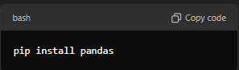
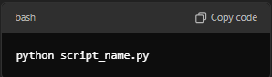

# lifebear_Alpha

# ReadMe

# Data Processing Workflow for Lifebear Dataset
Overview
This Python script uses the pandas library to load, transform, and save a CSV dataset from Lifebear. It performs several data preprocessing steps, including renaming columns, formatting dates, and splitting the dataset into smaller chunks. The script also detects and handles missing values (discrepancies) during chunking and merges cleaned chunks back into a single dataset.

Requirements
Python 3.x
pandas library

To install the required library, run:

# Steps Performed by the Script

# 1. Loading and Cleaning the Data
Load the Original Dataset: The script attempts to load a CSV file located at /content/3.6M-Japan-lifebear.com-Largest-Notebook-App-UsersDB-csv-2019.csv.
Rename Columns: The following columns are renamed for better readability:

id ➜ id_num
login_id ➜ user_name
mail_address ➜ email_address
birthday_on ➜ DOB
created_at ➜ start_date
Format start_date: If the start_date column exists, it is formatted to display only the time in HH-MM-SS. Any problematic values are replaced with the string 'NaN'.
Save Cleaned Data: The updated DataFrame is saved as step_1.csv at /content/step_1.csv.

# 2. Splitting the Cleaned Data into Chunks
Load Cleaned Data: The script reads step_1.csv.
Calculate Rows per Chunk: The total number of rows is calculated, and the DataFrame is divided into 5 equal-sized chunks.
Save Each Chunk: Each chunk is saved as a separate file named lifebear_dataset_chunk_{i + 1}.csv in the /content directory.

# 3. Handling Data Discrepancies
Identify and Handle Discrepancies: The script detects rows with missing values and separates them into a garbage.csv file.
Save Cleaned Chunks: The cleaned chunks (with discrepancies removed) are saved to CSV files.

# 4.  Merging the Cleaned Chunks
Load Chunk Files: The script attempts to load the cleaned chunk files.
Concatenate DataFrames: If any chunk files are successfully loaded, they are concatenated into a single DataFrame.
Save Merged Data: The merged DataFrame is saved as clean_lifebear.csv in the /content directory.

# Error Handling
File Not Found: If any required files are missing, appropriate error or warning messages will be displayed.
General Exceptions: Any unexpected errors during execution will be caught and displayed.

# Output
After successfully running the script, the following files will be generated:

/content/step_1.csv: Cleaned data after initial processing.
/content/lifebear_dataset_chunk_{i}.csv: Individual chunks of cleaned data.
/content/garbage.csv: Rows with missing values (if any).
/content/clean_lifebear.csv: Final merged dataset.

# Example Usage
To execute the script, ensure that the cleaned data (step_1.csv) is available in the specified location and run the script:

Replace script_name.py with the actual filename of your script
